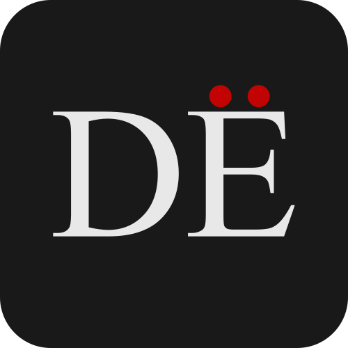

# README.md

  

This small Astro project is a space where students can learn German. The base translation language is Italian. The website is structured into four different sections:

* Verben (specifically built for verb learning)
* Vokabeln (a simple list of words to know, based on the learning program)
* Grammatik (a collection of grammatical rules and other theory)
* Üben (some exercises to test knowledge, work in progress)

The Astro stack is helpful for efficient and quick content management, thanks to its Markdown support. The rapid JavaScript integration will be used for the generation of flashcards and other types of exercises in the last section.